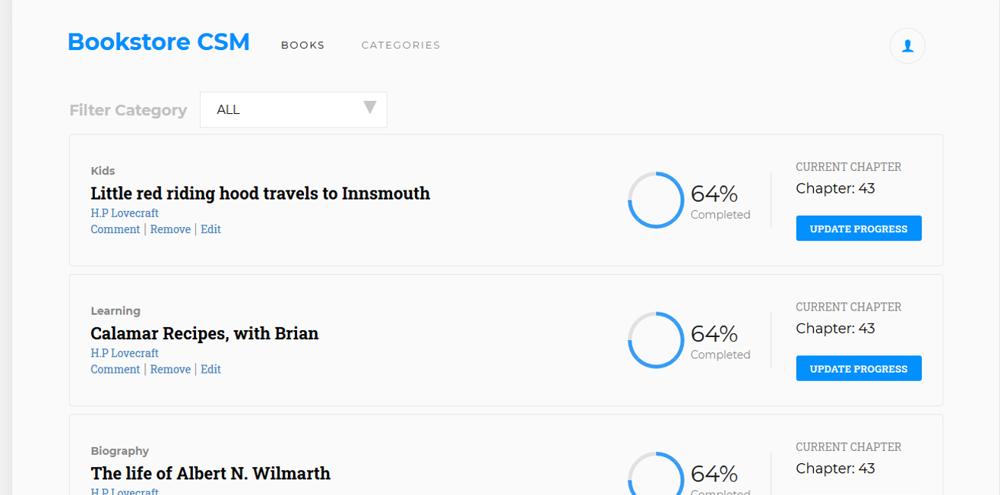
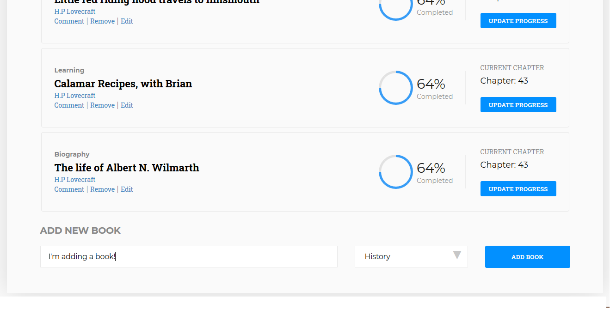

[![Contributors][contributors-shield]][contributors-url]
[![Issues][issues-shield]][issues-url]
<br />
<p align="center">
  <h2 align="center"> Bookstore </h2>
  <p align="center">
  	Bookstore (React/Redux :book:)
    <br />
    <a href="https://github.com/dannisonarias/bookstore"><strong>Explore the docs »</strong></a>
    <br />
</p>

# Bookstore management application

This project consists in building a bookstore application, using react-redux. Where you are able
to add books, remove them, and filter them by category.

Index
=====
   * [Built with](#built-with)
   * [Installation](#installation)
     * [Requirements](#requirements)
   * [Usage](#usage)
      - [Screenshots](#screenshots)
      - [Live](#live)
   * [Contributing](#contributing)

## Built with

- JavaScript/ES6
- React
- Redux
- Node.js
- Heroku
- RAW CSS


## Installation

### Requirements

You will need Node.js to run this project locally, or a built version and a local server.

---

 1) Clone this repository and access the project's directory.
```bash
cd ${folder_where_project_is}/
npm install
```
 2) For starting it local, run the next line.

```bash
npm start
```

After this open a browser and app will be hosted on a local server. (Port is display on console)

### Screenshots

### Main screen



<br>
<br>

### Bottom - Add book.



### Live
[Live version](https://bookcms.herokuapp.com/)

## Authors

👤 **Dannison Arias**

- Github: [@dannisonarias](https://github.com/dannisonarias)
- Twitter: [@AriasDannison](https://twitter.com/AriasDannison)
- Linkedin: [Dannison Arias](https://www.linkedin.com/in/dannison-arias-777919190/)

👤 **Facundo Iglesias**

- Github: [Github profile](https://github.com/Fig77)
- Linkedin: [Facundo Iglesias](https://www.linkedin.com/in/figlesias/)

## Contributing

Contributions, issues and feature requests are welcome!

## Show your support

Give a ⭐️ if you like this project!

## 📝 License

This project is [MIT](./license.md) licensed.

<!-- MARKDOWN LINKS & IMAGES -->
<!-- https://www.markdownguide.org/basic-syntax/#reference-style-links -->
[contributors-shield]: https://img.shields.io/badge/Contributors-2-brightgreen
[contributors-url]: https://github.com/Fig77/Gradients-Project/graphs/contributors
[issues-shield]: https://img.shields.io/badge/issues-0-%2300ff00
[issues-url]: https://github.com/Fig77/Template/issues
[product-screenshot]: assets/menu.png
